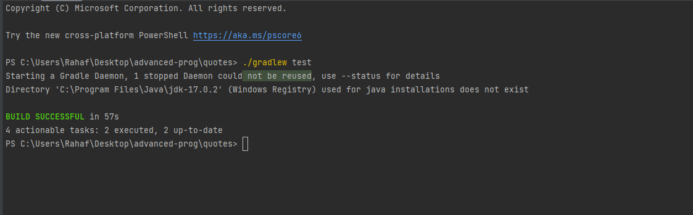

# overview 
URLConnection serves as the parent class for various connections between a Java application and a URL. This class offers a general API for URLs, and its specialized version, HttpURLConnection, extends this to support HTTP-related functionalities.

When a client program communicates with a server via a URL, it follows these steps:

1. **Create a URL Object:** Generate a URL object representing the target web address.
   ```java
   URL url = new URL("https://reqres.in/api/users");
   ```

2. **Obtain a URLConnection Object:** Use the `openConnection` method to acquire a URLConnection object.
   ```java
   URLConnection urlCon = url.openConnection();
   ```

3. **Cast to HttpURLConnection (if applicable):** If the URL protocol is HTTP, you can cast the URLConnection to an HttpURLConnection object.
   ```java
   HttpURLConnection httpCon = (HttpURLConnection) url.openConnection();
   ```

4. **Set the Request Method:** Indicate the desired HTTP method for the URL request, such as GET, POST, etc.
   ```java
   httpCon.setRequestMethod("GET");
   ```

5. **Retrieve and Process Data:** Fetch the response data by reading the InputStream of the HttpUrlConnection instance.
   ```java
   BufferedReader reader = new BufferedReader(new InputStreamReader(httpCon.getInputStream()));
   String responseLine;
   StringBuilder response = new StringBuilder();
   while ((responseLine = reader.readLine()) != null) {
       response.append(responseLine);
   }
   ```

6. **Close the Connection:** To release the connection resources, use the `disconnect()` method.
   ```java
   httpCon.disconnect();
   ```

In essence, URLConnection acts as the base class for handling connections to URLs in Java. HttpURLConnection is a specialized version of URLConnection specifically designed for HTTP connections, offering additional features tailored to HTTP protocols. The communication process with a server involves creating a URL, establishing a connection, specifying the request method, reading the response, and finally closing the connection to ensure resource management.


# Classes 
1. App 
2. AppTest 
3. localFile 
4. UrlQuote 


# Testing 


 
